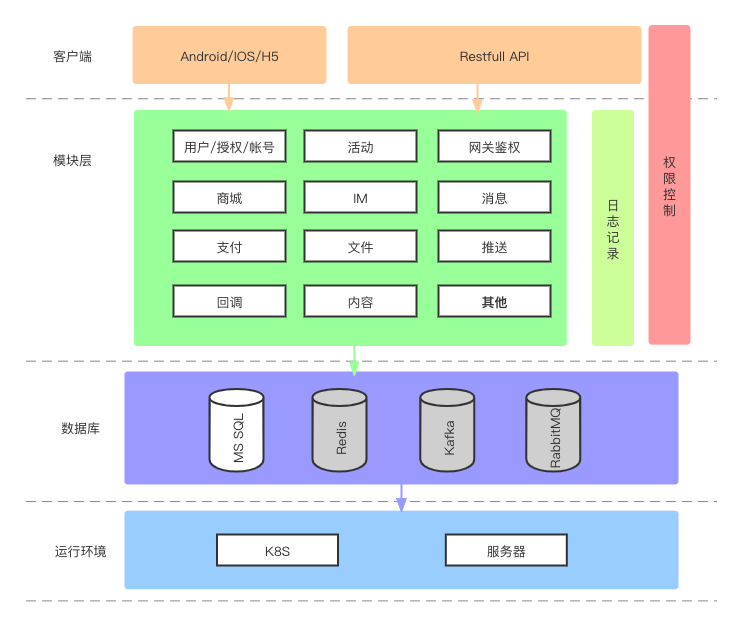

# 序

业务前提：因为业务快速发展，以前的中台服务不能满足快速且高效的产生新的产品，为了满足app跨机房、跨主体快速部署，且进一步减少人力成本维护和运维成本，实现Saas和Paas支持，切合业务需求

# 1、k8s部署架构说明

- 使用功能springcloud作为基础框架
- [apollo作为配置中心](apollo/readme.md)
- [consul作为注册中心](consul/readme.md)
- [rabbitMQ作为消息总线](rabbitmq/readme.md)
- [kafka作为日志消费队列](kafka/readme.md)
- mysql作为关系数据库存储
- mybatisPlus作为ORM框架
- redis作为NoSql缓存和业务KV支撑
- [filebeat作为日志收集](filebeat/readme.md)
- elasticsearch作为日志分析
- [grpc作为RPC](grpc.md)
- xxl-job作为分布式任务框架
- spring gateway+sentinel作为网关和限流
- [微服务项目部署模板](projects/readme.md)
- 使用对象服务作为日志备份
- 其他常用模块

# 2、标准架构设计

 基础服务架构

# 3、grpc框架

grpc 