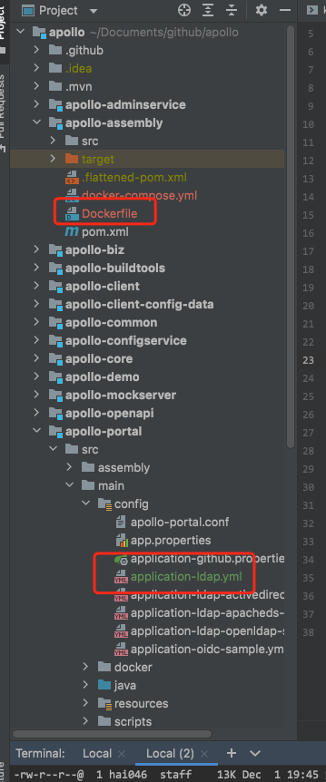

## 序

- `cheesetest.tencentcloudcr.com/base/apollo` 为私有化构建，portal `application-ldap.yml`
- 构建一个通用镜像，通过不同参数启动不动模块

## application-ldap.yml 配置文件

```yml
spring:
  ldap:
    base: "dc=xxx,dc=com"
    username: "cn=admin,dc=xxx,dc=com" # 配置管理员账号，用于搜索、匹配用户
    password: "******"
    searchFilter: "(uid={0})"  # 用户过滤器，登录的时候用这个过滤器来搜索用户
    urls:
      - "ldap://ldap.xxxx.com:389"

ldap:
  mapping: # 配置 ldap 属性
    objectClass: "inetOrgPerson" # ldap 用户 objectClass 配置
    loginId: "uid" # ldap 用户惟一 id，用来作为登录的 id
    rdnKey: "uid" # ldap rdn key，可选项，如需启用group search需要配置
    userDisplayName: "displayname" # ldap 用户名，用来作为显示名
    email: "mail" # ldap 邮箱属性
```
## Dockerfile 配置文件

``` yml
FROM openjdk:8-jre-alpine
MAINTAINER vroom-hai046
WORKDIR /apollo
ADD target/apollo-assembly-1.9.1.jar app.jar
ENV WORKSPACE=1.9.1
ENTRYPOINT java $JAVA_OPTS -XX:+UnlockExperimentalVMOptions -XX:+UseCGroupMemoryLimitForHeap -Duser.timezone=PRC -DServerName=apollo-service  -jar app.jar $PARAMS

```

- 源码 `git@github.com:apolloconfig/apollo.git`
- 优先导入sql到数据库
- 你可以按照单击部署或者docker-compose部署，这里只关注k8s部署
- 文件目录示意图
- 使用ldap部署`protal`管理后台需要配置一个或多个管理员`-DsuperAdmin=`，否则你进不去 😄

目录示意图



## 配置文件


```yaml
kind: StatefulSet
apiVersion: apps/v1
metadata:
  name: apollo-admin-config
  labels:
    app: apollo-admin-config
spec:
  replicas: 2
  selector:
    matchLabels:
      app: apollo-admin-config
  strategy:
    rollingUpdate:
      maxSurge: 1
      maxUnavailable: 1
    type: RollingUpdate
  template:
    metadata:
      labels:
        app: apollo-admin-config
    spec:
      imagePullSecrets:
        - name: 100015858417-tcr-mvxfrvzn-dockercfg
      containers:
        - image: cheesetest.tencentcloudcr.com/base/apollo
          securityContext:
            privileged: true
          imagePullPolicy: IfNotPresent
          name: container-apollo-admin-server-dev
          ports:
            - protocol: TCP
              containerPort: 8090
            - protocol: TCP
              containerPort: 8080
          env:
            - name: JAVA_OPTS
              value: -Dapollo_profile=github -Dspring.datasource.url=jdbc:mysql://xxxx:3306/ApolloConfigDB?characterEncoding=utf8&useSSL=false -Dspring.datasource.username=apollo -Dspring.datasource.password=xxxx
            - name: PARAMS
              value: --configservice --adminservice
          readinessProbe:
            tcpSocket:
              port: 8090
            initialDelaySeconds: 10
            periodSeconds: 5
          livenessProbe:
            tcpSocket:
              port: 8090
            initialDelaySeconds: 60
            periodSeconds: 10

      dnsPolicy: ClusterFirst
      restartPolicy: Always

---
kind: StatefulSet
apiVersion: apps/v1
metadata:
  
  name: apollo-portal
  labels:
    app: apollo-portal
spec:
  replicas: 1
  selector:
    matchLabels:
      app: apollo-portal
  strategy:
    rollingUpdate:
      maxSurge: 1
      maxUnavailable: 1
    type: RollingUpdate
  template:
    metadata:
      labels:
        app: apollo-portal
    spec:
      imagePullSecrets:
        - name: 100015858417-tcr-mvxfrvzn-dockercfg
      containers:
        - image: cheesetest.tencentcloudcr.com/base/apollo
          securityContext:
            privileged: true
          imagePullPolicy: IfNotPresent
          name: apollo-portal
          ports:
            - protocol: TCP
              containerPort: 8070
            - protocol: TCP
              containerPort: 8070
          env:
            - name: JAVA_OPTS
              value: -Dapollo_profile=github -Dapollo_profile=github,ldap -DsuperAdmin=denghaizhu -Ddev_meta=http://apollo-meta:8080 -Dserver.port=8070 -Dspring.datasource.url=jdbc:mysql://10.10.0.12:3306/ApolloPortalDB?characterEncoding=utf8&useSSL=false -Dspring.datasource.username=apollo -Dspring.datasource.password=&&****
            - name: PARAMS
              value: --portal
          readinessProbe:
            tcpSocket:
              port: 8070
            initialDelaySeconds: 10
            periodSeconds: 5
          livenessProbe:
            tcpSocket:
              port: 8070
            initialDelaySeconds: 60
            periodSeconds: 10

      dnsPolicy: ClusterFirst
      restartPolicy: Always

---
# 主机端口访问模式，这个可以通过节点访问，前面可以加自己网关入口，不用lb是因为lb厂商按量收费
apiVersion: v1
kind: Service
metadata:
  name: service-apollo-portal
spec:
  externalTrafficPolicy: Cluster
  ports:
  - name: 8070-8070-tcp
    nodePort: 30070
    port: 8070
    protocol: TCP
    targetPort: 8070
  selector:
     app: apollo-portal
  sessionAffinity: None
  type: NodePort

---
kind: Service
apiVersion: v1
metadata:
  name: apollo-config
  labels:
    app: apollo-config
  annotations:
    kubesphere.io/creator: admin
spec:
  ports:
    - name: http-8080
      protocol: TCP
      port: 8080
      targetPort: 8080
  selector:
    app: apollo-admin-config
  type: ClusterIP
  sessionAffinity: None


```

